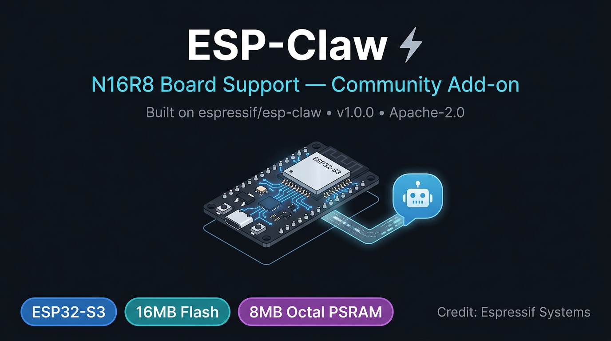

# ESP-Claw for ESP32-S3 N16R8



Run an AI agent on a $10 chip. No Linux. No Node.js. No server. Just an ESP32-S3, your Wi-Fi, and a Telegram bot.

> **Credit where it's due:** This repo is a **community board support add-on**, not an original project. The actual AI agent framework is [espressif/esp-claw](https://github.com/espressif/esp-claw), built by [Espressif Systems](https://github.com/espressif). All the hard work is theirs. What this repo adds is a pre-built firmware binary and custom board configuration for the **ESP32-S3 N16R8** (16MB flash + 8MB embedded PSRAM) — a board variant that is not yet included in the official ESP-Claw web flasher.

---

## What does it do?

Once flashed, your ESP32-S3 connects to your Wi-Fi and becomes an AI agent you can talk to via **Telegram**. It can:

- Answer questions using Claude, GPT, or any OpenAI-compatible model
- Set reminders and scheduled tasks
- Search the web (via Tavily)
- Control GPIO pins by chat command
- Remember things you tell it across reboots

---

## What you need

### Hardware
- **ESP32-S3 N16R8** development board (16MB flash, 8MB embedded PSRAM)
- A USB-C cable that supports data transfer (not charge-only)
- A computer running macOS or Windows

### Accounts (all free to create, API usage has a cost)
- [Telegram](https://telegram.org/) — free, create a bot via [@BotFather](https://t.me/BotFather)
- An AI API key — see the model section below for which ones work well
- [Tavily](https://app.tavily.com/) — web search, free tier available

### Cost reality check
This was tested in production. Here is what was found:

| Model | Works? | Cost per command |
|---|---|---|
| Claude Sonnet 4.6 (via OpenRouter) | Works great | ~$0.10–0.12 minimum, more for longer tasks |
| GPT-5.5 (via OpenRouter) | Works great | Similar range |
| Kimi K2 / Gemma 4 | Hit or miss | Not recommended |

Claude Sonnet 4.6 is the recommended starting point. It is reliable and gives smart responses. Use [OpenRouter](https://openrouter.ai) to access it with a single API key.

---

## Step 1 — Flash the firmware

You have two options. Option A is easier.

### Option A — Web flasher (no install needed, Chrome or Edge only)

1. Go to [espressif.github.io/esptool-js](https://espressif.github.io/esptool-js/)
2. Click **Connect** and select your board's serial port
3. Add each file from the `firmware/` folder and set the flash address for each:

| File | Flash address |
|---|---|
| `bootloader.bin` | `0x0` |
| `partition-table.bin` | `0x8000` |
| `ota_data_initial.bin` | `0xf000` |
| `basic_demo.bin` | `0x20000` |
| `storage.bin` | `0xb20000` |

4. Click **Program** and wait for it to finish
5. Press the **Reset** button on your board

### Option B — esptool command line (requires Python)

Make sure Python is installed, then run:

```bash
pip install esptool
```

Then from inside the `firmware/` folder:

```bash
python -m esptool --chip esp32s3 -b 460800 --before default_reset --after hard_reset \
  write_flash --flash_mode dio --flash_size 16MB --flash_freq 80m \
  0x0 bootloader.bin \
  0x8000 partition-table.bin \
  0xf000 ota_data_initial.bin \
  0x20000 basic_demo.bin \
  0xb20000 storage.bin
```

Replace the port with your device's port. On Mac it looks like `/dev/tty.usbmodem...`, on Windows it looks like `COM3`.

---

## Step 2 — Connect to the board's Wi-Fi

After the board boots (takes about 10 seconds), it creates its own Wi-Fi hotspot.

- On your phone or laptop, go to Wi-Fi settings
- Look for a network called **`esp-claw-xxxx`** (the last four characters are unique to your board)
- Connect to it — no password required

---

## Step 3 — Open the config page

Open a browser (any browser works here) and go to:

```
http://esp-claw.local/
```

If that does not load, try:

```
http://192.168.4.1/
```

You will see the ESP-Claw configuration page.

---

## Step 4 — Fill in your settings

Click the **Configuration** tab. Fill in the following sections:

### Wi-Fi
- **SSID:** your home or office Wi-Fi name
- **Password:** your Wi-Fi password

> Use 2.4GHz Wi-Fi only. The ESP32-S3 does not support 5GHz.

### LLM (the AI brain)

For Claude Sonnet 4.6 via OpenRouter:

| Field | Value |
|---|---|
| Provider | Custom |
| Base URL | `https://openrouter.ai/api/v1` |
| API Key | your OpenRouter API key |
| Model | `anthropic/claude-sonnet-4-6` |

For GPT-5.5 via OpenRouter, use the same Base URL and API key, and set Model to `openai/gpt-4.5-preview` (check OpenRouter's model list for the exact slug).

### Telegram
- **Bot Token:** the token you got from [@BotFather](https://t.me/BotFather)

### Search
- **Tavily API Key:** your key from [app.tavily.com](https://app.tavily.com/)

### Time zone
- Set this to your local time zone so reminders work correctly (e.g. `Asia/Kolkata`)

Click **Save Changes**. The board will restart and connect to your Wi-Fi. This takes about 20 seconds.

---

## Step 5 — Test it

Open Telegram, find the bot you created with BotFather, and send it a message:

```
Hi, what can you do?
```

It should reply within a few seconds. If it does, you are all set.

---

## Troubleshooting

**I do not see the `esp-claw-xxxx` Wi-Fi network**
- Wait 30 seconds after the board powers on, then check again
- Press the Reset button on the board and wait again
- Make sure you flashed all five files at the correct addresses

**The config page does not load**
- Try `http://192.168.4.1/` instead of `http://esp-claw.local/`
- Make sure your device is connected to the `esp-claw-xxxx` Wi-Fi, not your regular Wi-Fi

**The Telegram bot does not reply**
- Check that your API key is correct and has credit
- Double-check the bot token — copy it again from BotFather
- Make sure the board connected to your Wi-Fi (the `esp-claw-xxxx` hotspot disappears once it connects)

**The board gets stuck after flashing (timing issue)**
- This happens when using a generic or wrong firmware build for your board
- The pre-built firmware in this repo is compiled specifically for the ESP32-S3 N16R8 (16MB flash, 8MB embedded PSRAM) to avoid this
- If you see a boot loop, re-flash using the files from the `firmware/` folder in this repo

**Kimi or Gemma models give inconsistent results**
- This was tested — those models work sometimes but are not reliable enough for day-to-day use
- Stick with Claude Sonnet 4.6 or GPT-5.5

---

## What makes this different from the official ESP-Claw web flasher?

The official [esp-claw.com/en/flash](https://esp-claw.com/en/flash) web flasher does not include the ESP32-S3 N16R8 board. If you flash a generic build onto it, the firmware gets stuck on boot because the PSRAM timing settings do not match your chip (16MB quad flash + 8MB embedded octal PSRAM).

This repo contains firmware compiled specifically for that board with the correct settings:
- `CONFIG_ESPTOOLPY_FLASHSIZE_16MB=y`
- `CONFIG_SPIRAM_MODE_OCT=y`
- `CONFIG_SPIRAM_SPEED_80M=y`
- Partition table sized for 16MB

---

## Want to rebuild the firmware yourself?

See [BUILD_FROM_SOURCE.md](BUILD_FROM_SOURCE.md).

---

## Credits

This repo would not exist without the following:

| Project | What they made | Link |
|---|---|---|
| **espressif/esp-claw** | The entire AI agent framework — chat, LLM, Telegram, scheduling, everything | [github.com/espressif/esp-claw](https://github.com/espressif/esp-claw) |
| **Espressif Systems** | The ESP32-S3 chip, ESP-IDF toolchain, and esptool | [espressif.com](https://www.espressif.com/) |
| **Anthropic / OpenAI** | The AI models (Claude, GPT) that make the agent actually useful | — |
| **OpenRouter** | The API gateway used for model access | [openrouter.ai](https://openrouter.ai) |

This repo only adds:
- A board config for the ESP32-S3 N16R8 (16MB flash + 8MB embedded octal PSRAM)
- A pre-built binary so you can flash without setting up ESP-IDF
- This friendly guide

---

## License

Apache-2.0 — same as upstream esp-claw. See [LICENSE](LICENSE).
